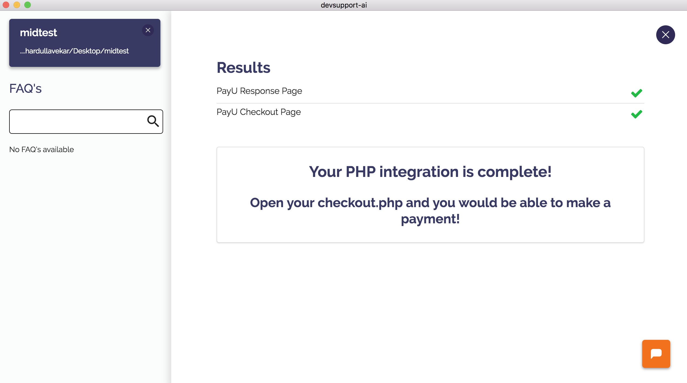

# PayUBiz PHP Integration 

At PayU, we are committed to offer a seamless integration experience to our developers. 

We are happy to launch Devsupport AI - a bot programmer that integrates PayU with your code in few minutes.

At the end of this, you can test accepting payments on PayU *Sandbox Environment*.

## What do I need?

* Merchant Key

* Salt

Get both these keys from [PayU Dashboard](https://testtxncdn.payubiz.in/login)

## PHP Integration

* Download the [Devsupport AI tool](https://github.com/artpar/devsupport/releases/latest). Install the .exe if you are on Windows, mac.zip if you are on Mac and .deb if you are on Linux. You should see a screen below:

* Create a folder on your computer and create an index.php or index.html file in the folder.

* Open Devsupport AI tool and drop the folder in the tool when asked for.

* Search for PayU when asked for Product you'd like to integrate

* Click on PayU Seamless or non-seamless Payment Integration

* Enter your Sandbox Merchant Key and Salt & Proceed.   *If you enter wrong key combination, the tool will throw an error!*

* Devsupport AI will give you response.php. We post the success/failure response on this URL. 

  	Host it on your server immediately after you download it.

* The tool will also give you checkout.php - this file helps you initiate a seamless/non-seamless payment with PayU. 

  	Host this file on your server and keep the URL ready.

** Note that both response.php and checkout.php contain your Sandbox Credentials. DO NOT Modify them.**  

* If everything went well, you should see a success screen like this:

## Switching to Production?

  Get your production merchant key and salt from [PayU Production dashboard](https://txncdn.payubiz.in/login).

### Changes in response.php 

* Change the Salt to Production Salt
* Change the Merchant Key to Production Merchant Key

### Changes in checkout.php

* Change the Salt to Production Salt
* Change the Merchant Key to Production Merchant Key
* Change the URL from https://test.payu.in to https://secure.payu.in 

*You can modify the amount and txn Id as per your logic*

Voila! If everything went well, you can open the page where you copy pasted the HTML tag and test the payments.

## Need help?

You can chat with us using the orange icon on the tool or write us an email at support[at]devsupport[dot]ai - happy to help!